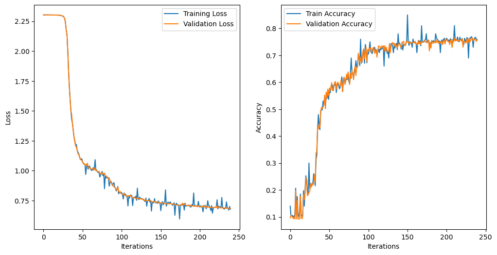
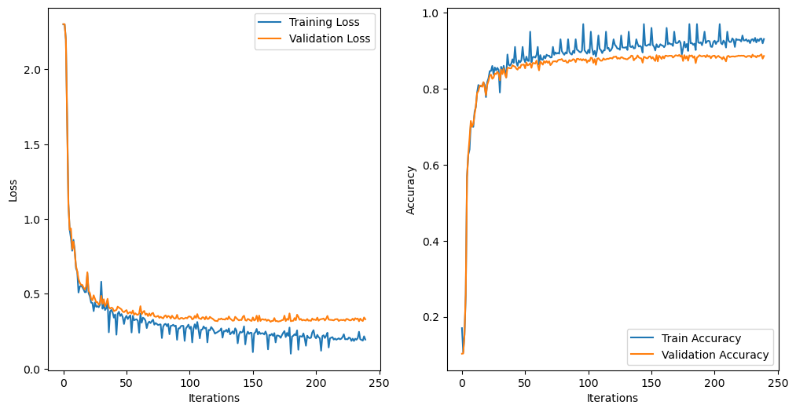

# 项目总览

​	**本项目构建了一个基于 Python 模块化设计的多层感知机（MLP）神经网络。整个项目主体（*Fashion_minist_model.ipynb*）包含下面所列出的四个部分，同时项目的模块化设计将 Fully Connected Layer, Relu Layer, Softmax Layer 等网络基础模块存放于 python文件 *modules.py* 中。**

- **1. Load data and preprocess**
- **2. Build the model**
- **3. Hyperparameter Tuning**
- **4. Train the model with best hyperparameters**
- **5. Model Test**

​	**接下来按照上面的顺序分别具体介绍各个部分。**

---

---

# 1. **Load data and preprocess**

​	数据加载与处理部分首先使用 Fashion MINIST 数据集所提供的 mnist_reader 工具加载存放在本地（包含了Repo中）的 Fashion MINIST 数据集，将二维的28*28灰度图拉伸为长度为784的向量，并进行归一化。

​	除此之外还按照 9 : 1 的划分比例从训练集划分出验证集。

---

---

# 2. **Build the model**

#### 初始化与配置（`__init__` 方法）
- **参数配置**：
  - `layers`: 表示每层神经元的数量，从输入层到输出层。
  - `lr` (学习率): 决定了参数在梯度下降过程中更新的步长。
  - `activation`: 指定使用的激活函数类型，如 ReLU、Sigmoid 或 Tanh。
  - `max_epoch`: 训练的最大轮次。
  - `batch_size`: 每个mini-batch的样本数，用于小批量梯度下降。
  - `L2_lambda`: L2 正则化的强度，用于防止过拟合。
  - `decay_factor` & `decay_steps`: 学习率衰减相关参数，定期减小学习率以提高模型稳定性和性能。
  - `print_log`: 是否打印训练日志。
  - `print_iter`: 每多少批次打印一次日志信息。

#### 模型构建 (`init_model` 方法)
- **初始化定义模型中每一层的对象**：
  - 遍历`layers`数组，按照设定的size为每个相邻的层大小组合初始化一个全连接层（`FC`）。
  - 根据指定的`activation`参数，在每个全连接层后添加相应的激活层，除了最后输出层前。
  - 最后添加一个`Softmax`层，用于输出预测概率并进行分类。

#### 前向传播（`forward` 方法）
- **从前向后调用网络中每一层 layer 对象的 forward 方法**：
  - 输入数据通过每一层的全连接部分和激活函数传递，直到达到输出层。
  - 如果设置`save_activations=True`，则保存并返回每层的激活输出。

#### 反向传播（`backward` 方法）
- **依次从后向前调用网络中每一层 layer 对象的 backward 方法**
  - 每个 layer 对象的 backword 方法都接受一个 topdiff 参数并返回 bottomdiff。

#### 参数更新（`update` 方法）
- **更新参数**：
  - 对每个 layer 对象使用反向传播计算得到的梯度和当前学习率更新每层的权重和偏置。

#### 评估模型（`evaluate` 方法）

- **性能评估**：
  - 在验证集上运行模型前向传播得到预测结果，计算 accuracy 和 loss。

#### 训练过程（`train` 方法）
- **训练动态**：
  - 对于每一个epoch，随机打乱训练数据，进行mini-batch处理。
  - 每个batch执行一次前向传播和反向传播。
  - 定期衰减学习率，根据`decay_factor`和`decay_steps`减小。
  - 每`print_iter`个batch打印一次训练和验证的损失及准确率。
  - 每`print_iter`个batch更新一次当前在验证集上准确率最高的最优权重，以便最后最优权重的保存。

#### 参数的保存与加载
- **保存最优参数** (`get_parameters` 和 `save_param` 方法):
  - 通过`get_parameters`方法提取当前网络的所有参数。
  - 如果当前模型的验证准确率超过之前所有训练周期的准确率，则认为是最优模型，并将参数保存到文件（使用 NumPy 的`.npy`格式）。
- **加载参数** (`load_model` 方法):
  - 加载先前保存的参数文件，使用`load_param`方法将参数赋值给相应的层。

#### 绘图展示（在`train`方法中的最后部分）

- 使用`matplotlib.pyplot`展示训练和验证过程中的损失与准确率变化，可视化模型性能的提升过程。

  

####   	模型通过结构化的实现使得神经网络易于调试、修改和扩展。每个组件的明确分工和功能保证了代码的可读性和可维护性。同时整体通过模块化的设计，用封装完善的基础layer对象替代了前向、后向传播以及梯度更新中的计算过程，使代码更简洁明确。

---

---

# 3. Hyperparameters Tuning

#### 超参数定义
- **学习率** (`learning_rates`): 学习率是影响模型学习速度的关键因素。选定的学习率包括 [0.005, 0.01, 0.05, 0.1]，覆盖了从较慢到较快的学习速度。
- **层结构** (`layer_sizes`): 网络层的结构和每层的神经元数直接影响模型的容量。本次试验包括了不同大小的三种结构，以调查更深或更宽的网络结构对性能的影响。
- **正则化强度** (`regularization_strengths`): 正则化用于控制模型的复杂度和防止过拟合，本次使用的 L2 正则化强度包括 [0, 0.001, 0.01, 0.05]。
- **其他参数**: 包括固定的激活函数（ReLU）、最大训练周期（40个epoch）、批次大小（100）、以及学习率衰减策略。

#### 训练和评估流程
对每一组超参数组合，模型从初始化到训练，最后在验证集上进行评估。每次训练的时间被记录下来，以便分析不同参数组合下模型训练的效率。

- **训练**: 对每一组参数，初始化相应的模型，按照指定的最大周期数进行训练，并适时通过学习率衰减机制调整学习率。
- **评估**: 训练完成后，模型在验证集上进行性能评估，计算验证集上的准确率和损失。
- **结果记录**: 每组参数的结果被记录并保存，包括层结构、学习率、正则化强度、验证准确率、验证损失和训练所需时间。

#### 结果

- 将不同参数组合的模型表现（验证集准确率，验证集loss）绘制成表格：*（这里只展示模型表现排行前五种组合，完整数据见Repo中log目录下的csv文件）*

| Layer Sizes         | Learning Rate | Regularization Strength | Validation Accuracy | Validation Loss | Training Time (seconds) |
| ------------------- | ------------- | ----------------------- | ------------------- | --------------- | ----------------------- |
| [784, 256, 128, 10] | 0.10          | 0.000                   | 0.892167            | 0.319772        | 118.843                 |
| [784, 256, 128, 10] | 0.10          | 0.001                   | 0.890000            | 0.307621        | 119.124                 |
| [784, 128, 64, 10]  | 0.10          | 0.000                   | 0.888000            | 0.325634        | 40.580                  |
| [784, 256, 128, 10] | 0.05          | 0.000                   | 0.887833            | 0.310882        | 119.474                 |
| [784, 256, 128, 10] | 0.05          | 0.001                   | 0.886500            | 0.322311        | 118.607                 |

- **这里展示两张不同参数组合下模型训练过程中在训练集和验证集上的loss曲线和accuracy曲线：**
  - 左侧为 layer = [784, 64, 32, 10], learning rate = 0.01, regularization strength = 0.01
  - 右侧为 layer = [784, 64, 32, 10], learning rate = 0.1,  regularization strength = 0

         

​												*图 1*

- **综合评价**：

  - Layers = [784, 256, 128, 10]
  - learning rate = 0.10
  - L2 Regularization Strength = 0.00

  **考虑准确率、损失和训练时间，发现上面的参数组合具有较高的准确率和相对较低的损失，虽然训练时间较长，是较为理想的超参数选择。**

  

---

---

# 4. Training with best hyperparameters

- 采用参数搜索得到的最优超参数组合重新训练最终选用的模型，并得到训练过程中在验证集表现最佳的模型权值，以便后续模型测试等。
  - **图 3 为训练过程中在训练集和验证集上的loss曲线和accuracy曲线：**

​												*图 2*

---

---

# 5. Model Test

## 5.1 Test saved model

​	创建一个新的模型对象并调用 LoadModel 方法将训练时保存的最优权重加载到测试模型 **Model_test** 中，将测试集作为输入执行前向传播得到预测结果，计算模型在测试集上的**交叉熵损失**和**Accuracy**。结果如下：

- **Test Accuracy: 0.8932 **

- **Test Loss: 0.324949**

---

## 5.2 Test on test images

​	为了更直观地体现模型的预测效果，随机选取12张测试集中的图片进行分类，并将图片可视化：

​											   *图 3*

---

## 5.3 Visualization

​	为了进一步探索模型训练所得到最优权重的特征与模式，以及输入不同图像模型的表现，进行了如下的可视化探索：

#### （1）**全连接层权值可视化：**

​											 *图 4*

​											 *图 5*

​											 *图 6*

- **观察与分析：**

####（2）**激活层状态可视化：**

|  |  |
| ------------------------------------------------------------ | ------------------------------------------------------------ |
|  |  |

​										    	*图 7*

- **观察与分析：**